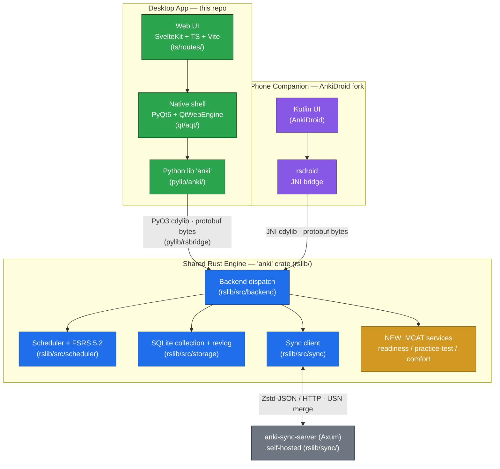
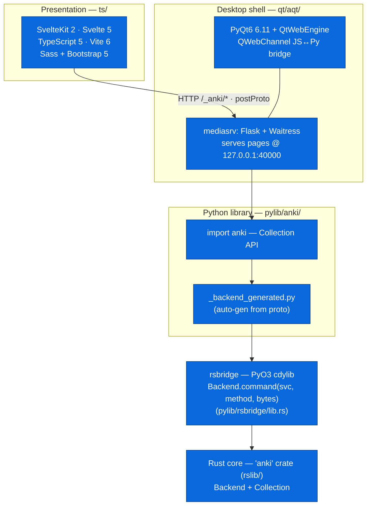
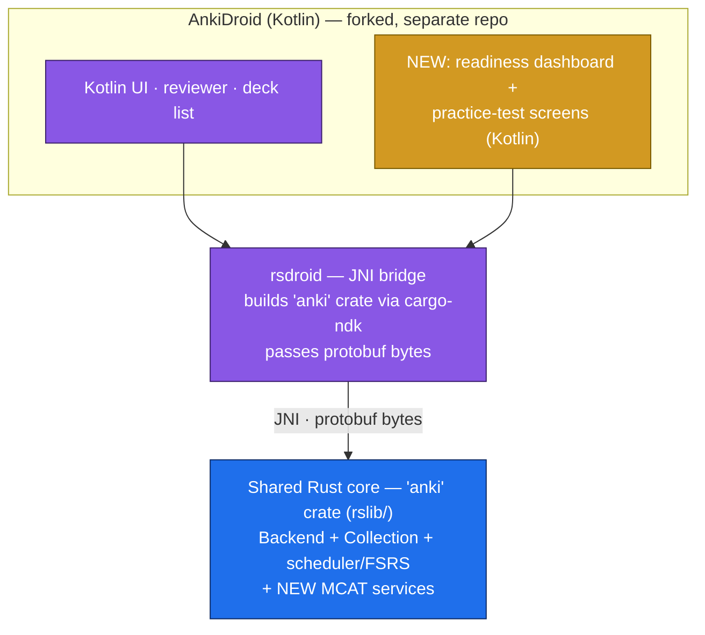
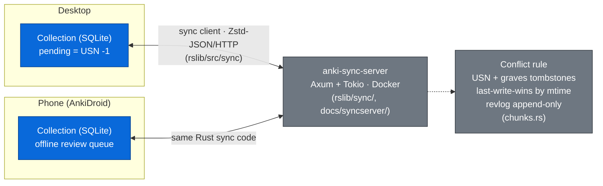

# Speedrun Tech Stack — MCAT Study App on Anki (Desktop + Android)

> One Rust engine (`anki` crate, `rslib/`), two clients. Every engine change lands in
> `rslib` and ships to both. License: **AGPL-3.0-or-later**, credit to Anki (parts BSD-3).
> Product scope lives in [anki_prd_mvp.md](anki_prd_mvp.md) / [anki_prd_post_mvp.md](anki_prd_post_mvp.md).

## 1. Two apps, one engine (hero view)

Both bridges hit the **same entrypoint** — `Backend.command(service, method, bytes)` —
passing serialized protobuf. The protobuf service contracts in `proto/anki/` are the single
IPC boundary for every client.

## 2. Desktop stack (detailed layering)

| Layer            | Tech                                                           | Location                       |
| ---------------- | -------------------------------------------------------------- | ------------------------------ |
| Web UI           | SvelteKit 2, Svelte 5, TypeScript 5, Vite 6, Sass, Bootstrap 5 | `ts/routes/`, `ts/lib/sass/`   |
| Native shell     | PyQt6 6.11 + QtWebEngine, QWebChannel                          | `qt/aqt/webview.py`, `main.py` |
| Local web server | Flask + Waitress (`mediasrv`)                                  | `qt/aqt/mediasrv.py`           |
| Python library   | CPython 3.13, `import anki`                                    | `pylib/anki/`                  |
| Language bridge  | **PyO3 `cdylib`**                                              | `pylib/rsbridge/lib.rs`        |
| Engine           | Rust `anki` crate                                              | `rslib/`                       |

## 3. Android stack (AnkiDroid fork)

| Layer  | Tech                                            | Source                                              |
| ------ | ----------------------------------------------- | --------------------------------------------------- |
| UI     | Kotlin (AnkiDroid screens + new MCAT screens)   | AnkiDroid fork                                      |
| Bridge | `rsdroid` JNI, `cargo-ndk` builds `anki` `.so`  | AnkiDroid fork, depends on this repo's `anki` crate |
| Engine | **the same `anki` crate** (pinned to your fork) | `rslib/` (this repo)                                |

> The engine change you make in `rslib` reaches Android by pinning AnkiDroid's `rsdroid`
> dependency to your fork's `anki` crate — no scheduler reimplementation in Kotlin.

## 4. Sync & data topology

## 5. Where the Speedrun work lands

| Spec requirement                                                                  | Layer it lives in                            | Path                                                                    |
| --------------------------------------------------------------------------------- | -------------------------------------------- | ----------------------------------------------------------------------- |
| Real Rust change (§7a: points-at-stake queue / topic-aware sched / mastery query) | **Engine** — new proto msg + scheduler/query | `proto/anki/`, `rslib/src/scheduler/`, `rslib/src/services.rs`          |
| 3 Rust unit tests + 1 Python-calling test                                         | Engine + pylib                               | `rslib/src/...`, `pylib/tests/`                                         |
| Memory model (FSRS) + answer-time comfort                                         | Engine                                       | `rslib/src/scheduler/fsrs/`, `rslib/src/revlog/mod.rs` (`taken_millis`) |
| Performance + readiness services                                                  | Engine, exposed like `StatsService`          | `proto/anki/`, `rslib/src/stats/service.rs` pattern                     |
| Readiness dashboard (3 scores + ranges)                                           | Desktop UI + Android UI                      | `ts/routes/` (new page) + AnkiDroid Kotlin screen                       |
| Two-way sync + conflict rule                                                      | Engine (sync)                                | `rslib/src/sync/collection/chunks.rs`                                   |
| Desktop installer                                                                 | Packaging                                    | `qt/installer/` (Briefcase: mac/windows/linux)                          |
| Phone build (signed APK)                                                          | AnkiDroid fork build                         | AnkiDroid Gradle                                                        |
| AI off still scores                                                               | All clients                                  | feature-flag the post-MVP AI service                                    |

## 6. Build & packaging toolchain

- **Orchestration:** `just` recipes → Rust-generated **Ninja** build (`build/configure`, `build/ninja_gen`, `build/runner`).
- **Toolchains:** Rust 1.92 (`rust-toolchain.toml`), CPython 3.13, Yarn 4.11 / Node, `uv` for Python deps, `protoc` (auto-fetched).
- **Codegen:** `proto/anki/*.proto` → Rust services (`rslib/src/services.rs`), Python (`_backend_generated.py`), TS (`@generated/backend`) via `rslib/proto/build.rs`.
- **Desktop installer:** Briefcase (`qt/installer/`, per-OS templates).
- **Android:** AnkiDroid Gradle + `cargo-ndk` (in the AnkiDroid fork).

## 7. Notes & risks

- **Mobile is the highest-risk track — phase it to the deadlines.** Wednesday: the phone
  builds and runs a **review session on the shared deck** (no two-way sync required yet).
  Friday: **two-way sync** (phone ↔ desktop, none lost or double-counted), offline-review-
  then-sync, and the three scores + give-up rule on the phone. Building AnkiDroid against a
  custom `anki` crate (`cargo-ndk`) plus the new Kotlin dashboard / practice-test screens is
  substantial — start it day one, don't leave it to Thursday. (Mirrors the MVP PRD's mobile
  phasing note.)
- **Two repos, one engine:** the AnkiDroid fork is a second repo that depends on this repo's
  `anki` crate (pin `rsdroid`'s dependency to your fork). The _engine change_ still satisfies
  "modify the core, not a plugin."
- **No in-repo mobile FFI** today — relying on AnkiDroid's proven `rsdroid` JNI avoids building one.
- **FSRS is the external `fsrs` crate v5.2.0** — extend around it (comfort signal, readiness), don't fork it lightly.
- **iOS deferred** — would need a new in-repo C-FFI/uniffi crate + Swift app; out of scope for the chosen Android path.
